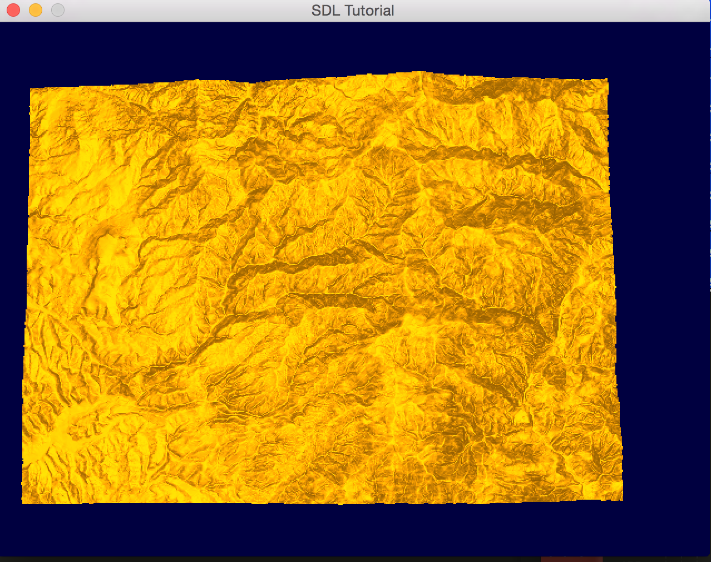
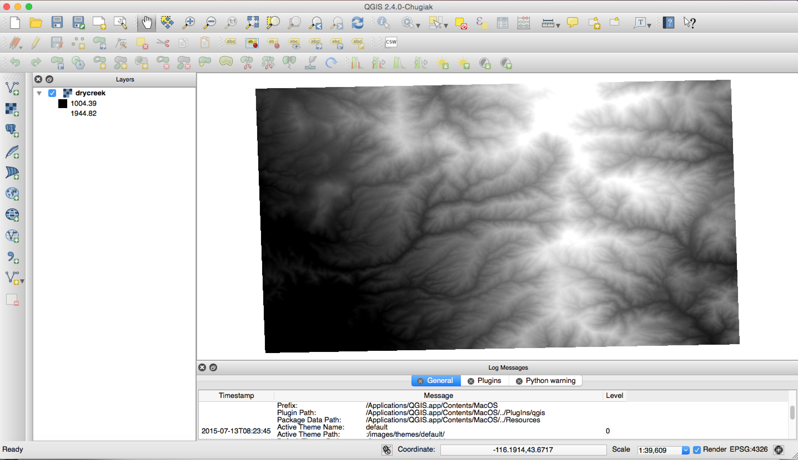

#Tutorial 2 - Building and Loading a DEM (Terrain)

**Introduction**
---------
In tutorial 2, the process of creating a mesh from a Digital Elevation Map (DEM) and visualizing it will be made clear. This tutorial will give one enough information to produce the mesh with its verticies and normals. Any extra lighting and effects will be left to the user, but one directional will be applied to the terrain to show that it works.

**Required Readings and Tutorials**
Required Tutorials
* Deferred Shading: http://ogldev.atspace.co.uk/www/tutorial35/tutorial35.html
* Texture Mapping: http://ogldev.atspace.co.uk/www/tutorial16/tutorial16.html

Required Readings
* Deferred vs Forward Shading : http://gamedevelopment.tutsplus.com/articles/forward-rendering-vs-deferred-rendering--gamedev-12342
* http://www.gdal.org/gdal_tutorial.html

**Steps for building a Terrain**
-----
1. Load the Data
2. Get Geospatial Information
3. Create the Mesh
4. Visualize the Mesh
5. Look at your constructed terrain.

**Loading the Data**
------
The very first thing we need to do is load some data to be visualized. I have provided some data to be visualized in the data directory. I will be using a DEM representation of an area in Boise, Idaho called Dry Creek. 

Lets create the GDAL dataset.
```c++
//vector<float> temp = vector<float>()
GDALDataset *poDataset;

// Register all gdal drivers
GDALAllRegister();

// lets load a "dataset" which is gdal terminology for your data
poDataset= (GDALDataset*) GDALOpen("drycreek.tif",GA_ReadOnly);

```
GDAL datasets can consist of multiple layers of 2D datasets called bands. These bands consist of different information that is relative to the dataset that it is part of. In this case drycreek.tif only has one band which consists of the height information at each pixel in the raster. Each of these bands are guranteed to have the same height and width.

Here is an example of how to get the number of bands, width, and height in a dataset and grabbing the first band that is required:

``` c++
int numBands = poDataset->GetRasterCount();

// dimensions of our datasets
int width = poBand->GetXSize(); 
int height = poBand->GetYSize();

// Get first raster band
GDALRasterBand  *poBand;

poBand = poDataset->GetRasterBand( 1 );
```


Lets get the float data out of the first band of the tif and store it into another array in a form I like, while filling any no data value with a zero.
```c++


// Something to hold the data --- can be any storaged. 
float *pafScanline;
pafScanline = (float *) CPLMalloc(sizeof(float)*width*height);

// RasterIO will load the data
auto err = poBand->RasterIO(GF_Read,0,0,width,height,pafScanline,width,height,GDT_Float32,0,0);

// Here is something I like to do by my own preference
vector<vector<float>> out = vector<vector<float>>(width,vector<float> (height,0));

// move everything to a vector -- slow memory but okay for what we are doing especially when zeroing out zero values
for(int i = 0; i < width; i++)
{
  for(int j = 0; j < height; j++)
  {
    if(pafScanline[(height-1-i)*width+j] > 0)
      out[width-i-1][j] = pafScanline[(height-1-i)*width+j];
    else
      out[width-i-1][j] = 0;
  }
}
```

**Getting the Geospatial Data**
-----
From tutorial 1, I discussed everything about projections, width and height of a dataset, the geotransform, and the resolution of pixels. Lets put this to practice in the next code snippet where we will find average pixel resolution and convert coordinates to utm.

One thing about the tif we will be using today is that its bounding box primarily lies within UTM zone 11. Here is a function that will take any lat long point and convert it to UTM zone 11. While this code be a hard coded function for now, an important thing to note is that one should create a function that can handle multiple utm zones and even determine the utm to use. 
```c++
void transformToUtm(double& x, double& y)
{
    OGRSpatialReference    oUTM, *poLatLong;
    OGRCoordinateTransformation *poTransform;

    oUTM.SetProjCS("UTM 11 / WGS84");
    oUTM.SetWellKnownGeogCS( "WGS84" );
    oUTM.SetUTM( 11 );

    poLatLong = oUTM.CloneGeogCS();
    
    poTransform = OGRCreateCoordinateTransformation( poLatLong, &oUTM );
    if( poTransform == NULL )
    {
        return;
    }
    

    if( !poTransform->Transform( 1, &x, &y) )
    {
      // Error here
    }
};
```
All of the code above should be self explantory. An important thing to note about this code is the fact that I am considering on using UTM as opposed to Lat Long. Lat Long is nice as a angular system and not having to worry about what zone you are in, but the distances between to Lat Long points can be considerably small and could have problems with floating point precision. While in UTM the same two Lat Long will be meters apart and the distance will be considerally bigger preventing floating precision errors. The future tutorials will use UTM for placing everything in the world.

Now lets use this transformToUtm function to find the average x and y resolution in utm for the dataset, while getting the utm bounding box for this dataset.
``` c++
void ComputeGeoProperties(GDALDataset *poDataset, int width, int height, double& x, double& y,double& xright, double& ybottom, double& xres, double& yres)
{
    double adfGeoTransform[6];
    if( poDataset->GetGeoTransform( adfGeoTransform ) == CE_None )
    {
        printf( "Origin = (%.6f,%.6f)\n",
                adfGeoTransform[0], adfGeoTransform[3] );

        printf( "Pixel Size = (%.6f,%.6f)\n",
                adfGeoTransform[1], adfGeoTransform[5] );
        x = adfGeoTransform[0];
        y = adfGeoTransform[3];
        xright = x + adfGeoTransform[1]*width;
        ybottom = y + adfGeoTransform[5]*height;
    }
    else
    {
      return;
    }

    string proj;
    proj = string(poDataset->GetProjectionRef());

    OGRSpatialReference sr2;
    char* test = &proj[0];
    sr2.importFromWkt(&test);
    
    // Get Geography Coordinate System clone
    OGRSpatialReference* geog2 = sr2.CloneGeogCS(); 

    // Now to create coordinate transform function
    OGRCoordinateTransformation* poTransform2 = OGRCreateCoordinateTransformation( &sr2, geog2 );

    // Compute corners
    poTransform2->Transform(1,&x,&y);
    poTransform2->Transform(1,&xright,&ybottom);

    // Transform to utm on both corners
    transformToUtm(x,y);
    transformToUtm(xright,ybottom);
    cout << xright << " " << ybottom <<endl;
    
    // Lets compute the absolute width and height in utm
    double absoluteW = xright - x;
    double absoluteH = y - ybottom;

    // now lets compute the average resolution (in utm) of the DEM
    xres = absoluteW / width;
    yres = absoluteH / height;
};
```
Since UTM is in meters, the computed resolution is essential meters per pixel. Using this resolution we can compute the offsets for each vertex in a mesh.


**Creating the Terrain Mesh**
-----
With the dataset now loaded we can create a mesh with the data.

Currently we have something like this (but with the dots sticking out different various heights):


The goal of creating a mesh is literally to connect these dots in a triangle fashion that will result in the following:


The example that we will be considering will create the triangles in a more uniform fahsion where each group of four dots will have two triangles and normals for each point.

Here is some code that will construct a mesh based on the data we have currented loaded data.
```c++
struct Vertex
{
    glm::vec3 position; // where each dot is located
    glm::vec3 normal; // the normal for this dot
    glm::vec2 uv; // uvs for texture coordinate mapping
};

void createMesh(vector<vector<float>>& input,float xres, float yres,float max,vector<int>& indicies, vector<Vertex>& vertexes)
{
  // Our vertex information along with normals contained inside
  std::vector<Vertex> vectors = vector<Vertex>();

  // Lets do some index rendering because it will save us some memory to some degree
  vector<int> indexs = vector<int>();

  // Time to construct a height map based on the xres and yres for each group of four dots
  for(int i = 0; i < input.size()-1; i++)
  {
    for(int j = 0; j < input[i].size()-1; j++)
    {  

        float UL = (float)(input[i][j])/(float)(max); // Upper left
        float LL = (float)(input[i+1][j])/(float)(max); // Lower left
        float UR = (float)(input[i][j+1])/(float)(max); // Upper right
        float LR = (float)(input[i+1][j+1])/(float)(max); // Lower right

        if(UL <= 0)
        {
          UL = 0;
        }
        
        if(UR <= 0)
        {
          UR = 0;
        }

        if(LR <= 0)
        {
          LR = 0;
        }

        if(LL <= 0)
        {
          LL = 0;
        }
        
        vec3 ULV = {i*xres,UL*max,j*yres};
        vec3 LLV = {(i+1)*xres,LL*max,j*yres};
        vec3 URV = {i*xres,UR*max,(j+1)*yres};
        vec3 LRV = {(i+1)*xres,LR*max,(j+1)*yres};

        // compute smoothed normal
        vec3 a = ComputeNormal(ULV,i,j,input.size(),input[i].size(),input,max,xres,yres);
        vec3 b = ComputeNormal(LLV,i+1,j,input.size(),input[i].size(),input,max,xres,yres);
        vec3 c = ComputeNormal(URV,i,j+1,input.size(),input[i].size(),input,max,xres,yres);
        vec3 d = ComputeNormal(LRV,i+1,j+1,input.size(),input[i].size(),input,max,xres,yres);

        // Push back vector information for these group of dots
        vectors.push_back(Vertex{ {i*xres,UL,j*yres}, a, {(float)i/(float)input.size(),(float)j/(float)input[i].size()} } );
        vectors.push_back(Vertex{ {(i+1)*xres,LL,j*yres}, b, {(float)(i+1)/(float)input.size(),(float)j/(float)input[i].size()} } );
        vectors.push_back(Vertex{ {i*xres,UR,(j+1)*yres}, c, {(float)i/(float)input.size(),(float)(j+1)/(float)input[i].size()} } );
        vectors.push_back(Vertex{ {(i+1)*xres,LR,(j+1)*yres}, d, {(float)(i+1)/(float)input.size(),(float)(j+1)/(float)input[i].size()} } );

        // Push back indices for these verticies
        indexs.push_back(vectors.size() - 4);
        indexs.push_back(vectors.size() - 1);
        indexs.push_back(vectors.size() - 2);
        indexs.push_back(vectors.size() - 4);
        indexs.push_back(vectors.size() - 3);
        indexs.push_back(vectors.size() - 1);
        
    }
  }
```

This is a simple way to build terrain based on the given data and will work with random data as well. This code loops over the data and produces a trinagulated mesh with normals, uvs, and the position of the verticies that will be used for visualizing the terrain. The uvs that are generated can be used for applying textures to this generated mesh. The one function that may a question is ComputeNormal. ComputeNormal produces a normal that in normalized based on the four possible triangles surronding that point to produce a "smooth normal" at that point. 

Here is some code for computing the normal of a single point:
```c++
vec3 ComputeNormal(vec3 center, int i, int j, int width, int height,vector<vector<float>>& data, float Max, float xres, float yres )
{
  // Compute center of all values which is the i and j passed in
  vec3 left;
  vec3 right;
  vec3 up;
  vec3 down;
  vec3 sum = vec3(0,0,0);
  bool l = false;
  bool r = false;
  bool u = false;
  bool d = false;

  int count = 0;
  // Compute left
  if(i -1 >= 0)
  {
    left = vec3((i-1)*xres,data[i-1][j],j*yres);
    left = center - left;
    l = true;
  }

  // Compute right
  if(i+1 < width)
  {
    right = vec3((i+1)*xres,data[i+1][j],j*yres);
    right = center - right;
    r = true;
  }

  // Compute up
  if(j-1 >= 0)
  {
    up = vec3((i)*xres,data[i][j-1],(j-1)*yres);
    up = center-up;
    u = true;
  }

  // Compute down
  if(j+1 < height)
  {
    down = vec3((i)*xres,data[i][j+1],(j+1)*yres);
    down = center-down;
    d = true;
  }

  // Compute normals
    if(u  && r)
    {
      vec3 v1 = cross(up,right);
      if(v1.y < 0)
      {
        v1 *= -1;
      }
      sum += v1;
      count = count + 1;
    }
    if(u && l)
    {
      vec3 v1 = cross(up,left);
      if(v1.y < 0)
      {
        v1 *= -1;
      }
      sum += v1;
      count = count + 1;
    }
    if(d && r)
    {
      vec3 v1 = cross(down,right);
      if(v1.y < 0)
      {
        v1 *= -1;
      }
      sum += v1;
      count = count + 1;
    }
    if(d && l)
    {
      vec3 v1 = cross(down,left);
      if(v1.y < 0)
      {
        v1 *= -1;
      }
      sum += v1;
      count = count + 1;
    }

  // Compute average normal
  sum /= count;
  
  // Normalize it and return :D!!!! Enjoy your smoothed normal for some smooth shading!
  return normalize(sum);
};
```
As you can see I am taking the normals of the different triangles surronding one point and averaging them to produce a smooth normal. 

**Visualizing the Terrain**
-----
Now to go over code that will visualize our constructed mesh. First we need to load the data into some a Vertex  Buffer Object and a Index Element Array to hold our indicies.

``` c++
// Buffers
GLuint TerrainIndicies;
glGenBuffers(1,&TerrainIndicies);
glBindBuffer(GL_ELEMENT_ARRAY_BUFFER,TerrainIndicies);
glBufferData(sizeof(int)*indicies.size(), &indicies[0],GL_STATIC_DRAW);

GLuint VBO;
glGenBuffers(1,&VBO);
glBindBuffer(GL_ARRAY_BUFFER,VBO);
glBufferData(sizeof(Vertex)*vertexes.size(), &vertexes[0],GL_STATIC_DRAW);
```
The VBO buffer needs to be of the type GL_ARRAY_BUFFER to hold the uv,normal, and position data for each vertex, while the TerrainIndicies must be of type GL_ELEMENT_ARRAY_BUFFER to hold each index. As you can see GL_STATIC_DRAW has been specified in glBufferData because the terrain will be constantly drawn. This code will allow index rendering to be used.

With the buffers now setup for passing data to the graphics card for rendering, we can go over the shaders. For this tutorial I will be assuming one knows how to compile and link shaders. Both of the fragment and vertex shaders will be written for glsl version 3.30.

 Here is the vertex shader that will be needed:
```glsl
// Vert
#version 330

layout (location = 0) in vec3 poses;
layout (location = 1) in vec2 TexCoord;
layout (location = 2) in vec3 Normal;

uniform mat4 mvp;
uniform mat4 model;
uniform float Max;
uniform float Min;

out vec2 TexCoord0;
out vec3 Normal0;
out vec3 WorldPos0;

void main(void)
{
   vec3 p = poses;
   p.y *= Max;

   gl_Position = mvp*vec4(p,1);
   TexCoord0 = TexCoord;
   Normal0 = (model*vec4(Normal,0.0)).xyz;
   WorldPos0 = (model*vec4(p,1.0)).xyz; 
}
```
This vertex shader will pass the uvs, normals projected into the world, and the vertex projected into the world. One key important thing here is that we are only passing the vertex position in projected because for deferred shading. I will be giving shaders for both forward rendering and deferred rendering.

Here is the fragment shader that will be needed for deferred rendering. As you can see the rendering targets for this shader are WorldPosOut,DiffuseOut, NormalOut, and TexCoordOut. This tutorial does a good job of explaining deferred shading: http://ogldev.atspace.co.uk/www/tutorial35/tutorial35.html. 

```glsl
//frag
#version 330

in vec2 TexCoord0; 
in vec3 Normal0; 
in vec3 WorldPos0; 

layout (location = 0) out vec3 WorldPosOut; 
layout (location = 1) out vec3 DiffuseOut; 
layout (location = 2) out vec3 NormalOut; 
layout (location = 3) out vec3 TexCoordOut; 

void main() 
{ 
    WorldPosOut = WorldPos0; 
    DiffuseOut = vec3(.7,.45,.01); 
    NormalOut = normalize(Normal0); 
    TexCoordOut = vec3(TexCoord0, 0.0); 
}
```

Here is the shader that will be needed for forward rendering with a hard coded direction light:
```glsl
//frag
#version 330

uniform vec3 VertexToEye;

in vec2 TexCoord0; 
in vec3 Normal0; 
in vec3 WorldPos0; 

out vec3 ColorOut;

void main() 
{ 
    vec2 TexCoord = CalcTexCoord();
   	vec3 WorldPos = texture(gPositionMap, TexCoord).xyz;
   	vec3 Color = texture(gColorMap, TexCoord).xyz;
   	vec3 Normal = texture(gNormalMap, TexCoord).xyz;
   	Normal = normalize(Normal);
    
    // Directional light 
    vec3 color = vec3(1,1,1);
    vec3 dirlight = vec3(0,-1, 0); // lets make the light point perpendicular to the terrain
    
    // intensities
    float ambient = .5;
    float specular = 1.0;
    float diffuse = .5;
    
    //factors
    float specularpower = 2;
    
    float DiffuseFactor = dot(Normal,-dirlight);
    vec3 AmbientColor = color * ambient;
    vec3 DiffuseColor = vec3(0,0,0);
    vec3 SpecularColor = vec3(0, 0, 0);

    if(DiffuseFactor > 0)
    {

      
      DiffuseOut = vec3(.7,.45,.01); 
      NormalOut = normalize(Normal0); 
      TexCoordOut = vec3(TexCoord0, 0.0); 
    	DiffuseColor = color*DiffuseFactor*diffuse;

    	// specular calculations
    	vec3 VertexToEye = normalize(EyePos - WorldPos);
    	vec3 LightReflect = normalize(reflect(dirlight,Normal));
    	float Specular = dot(VertexToEye,LightReflect);
    	if(Specular > 0)
    	{
    		Specular = pow(Specular,specularPower);
    		SpecularColor = color* specular* Specular;
    	}
    }


   	ColorOut = Color * (AmbientColor + DiffuseColor + SpecularColor);
}
```

With both frag shaders complete it is now possible to visualize the mesh with:

```c++
 glDrawElements(
     GL_TRIANGLES,      // mode
     indicies.Size(),    // count
     GL_UNSIGNED_INT,   // type
     (void*)0           // element array buffer offset
 );
```
** Note: I have not included what needs to be passed into the shader the program. **


**Building and Running the Tutorial**
-----
```bash
cd tutorial2/build
make
../bin/out
```
The controls for the scene are:
* a: left
* d: right
* s: back
* w: forward
* r: up
* f: down
* q: rotate left
* e: rotate right
* z: rotate down
* x: rotate up

**Screenshot**



**Verfication Screenshot**



**Next Tutorial**
-------
In the next tutorial I will be going over how to build a shape file and placing it onto the terrain. 

**Final Remarks**
------
One thing to note about this tutorial is that it only represents one way a terrain can be constructed from a geotiff. One possible way that we could render this terrain is by building the terrain on the fly inside of a shader. This could have some possible performance saving and other cool rendering effects. Some other cool things to consider is making a tesselation shader that would control the level of detail of terrain based on how close you are to the terrain (i.e. the closer you are to the terrain the more verticies it renders).  
