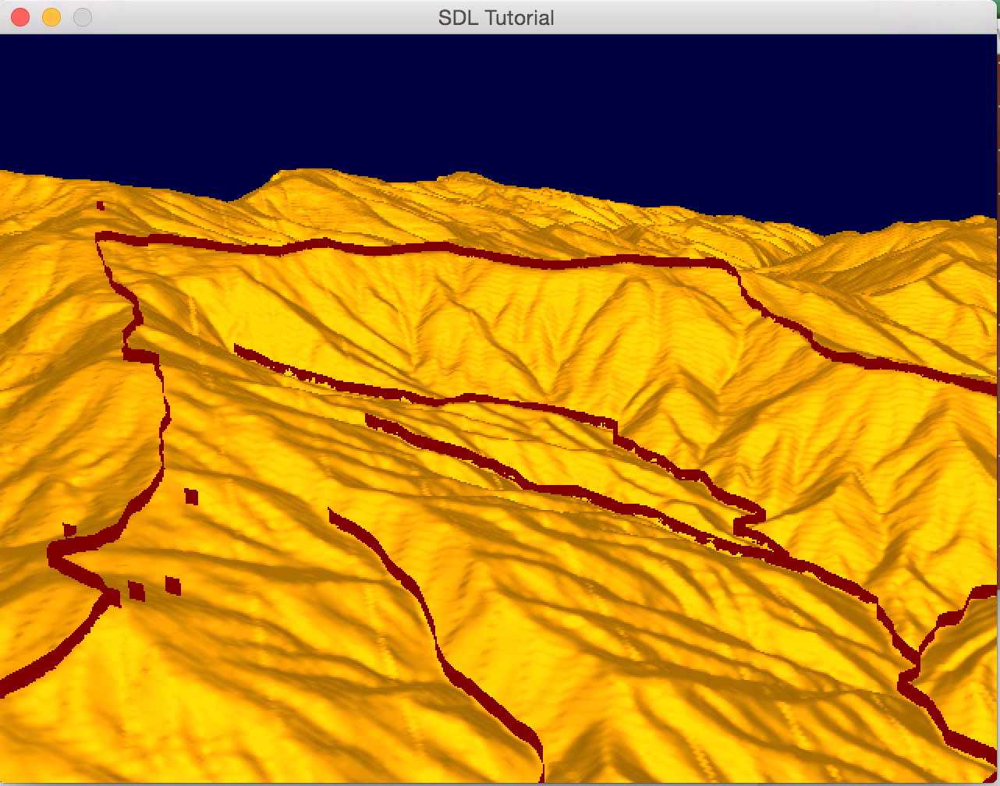
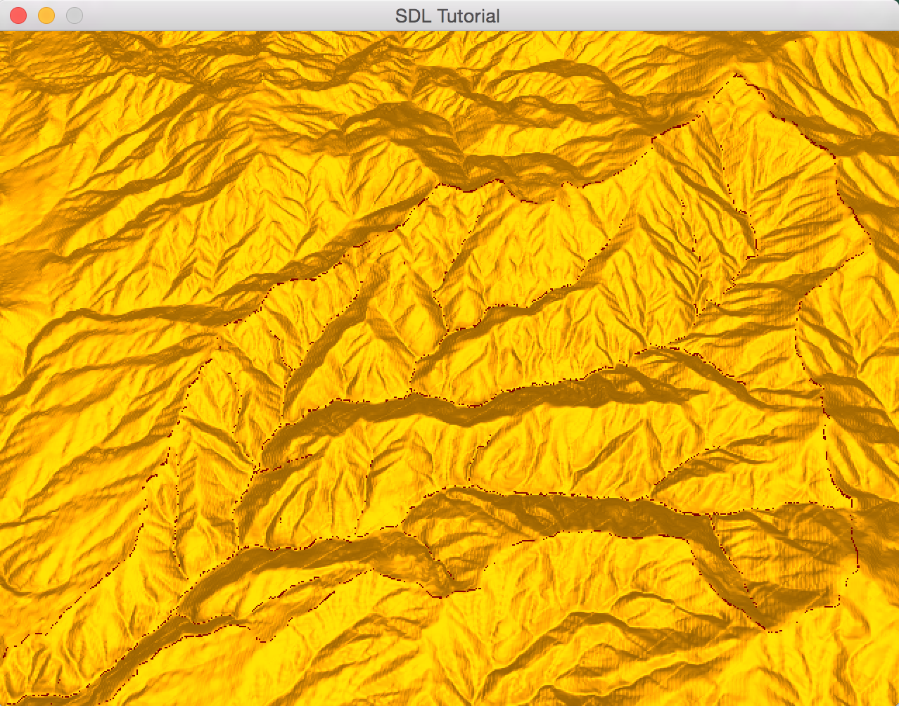
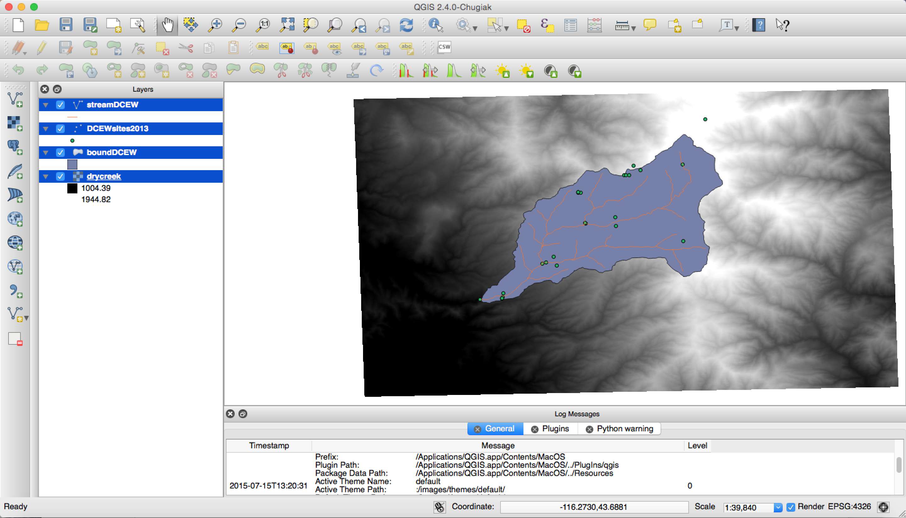

#Tutorial 3: Shapes 
-------


Just like the image shown above  we will be loading shapes, but of a more complex type. Like I discussed in the first tutorial shapes are vector detasets. Shapefiles are typically used for representing roads, weatherstations, boundairies of watersheds, and others.

**Steps for loading a shape**

1. Load the shape
2. Find all shapes within the data.
3. Deal with projecting the shapefile into your visualization
4. Visualize the shape(s)

**Getting the Shape Information**
------
The following headers will be need for getting information from shapefiles.
```c++
#include <gdal.h>
#include <gdal_priv.h>
#include <ogrsf_frmts.h>
```

We will be using the OGR portion of GDAL to get information of .shp files or a.k.a. the ESRI shapfile format. I will be using boundDCEW from my data section of this repo. 

Lets open a shapefile.
```c++
ds = OGRSFDriverRegistrar::Open( "boundDCEW.shp", FALSE );
```

Now that we have a shapefile open lets get it's projection information for future uses by grabbing the first layer in the shapefile.
```c++
    // Grab the first layer
    OGRLayer* layer = ds->GetLayer(0);

    // Grab the spatial reference and create a coordinate transform function
    sr = layer->GetSpatialRef();
```

A layer within a shapefile is very similar to a band in a GDAL dataset. Within a shapefile layer there are many features that can contain anything from metadata to the actual shapedata itself or the geometry. In this case we only care for the geometry within the dataset.

**What types of Shapes are there**
--------
Since we are dealing with a  vector dataset, there can be points that are connected or not connected all. A bunch of connected points can form lines, different shapes, and different polygons. While in vice versa there can be single points that are not connected to anything. In a shapefile it is possible for the points to be 2D or 3D. Let's take a second look at the shape loading code above and create a data structure to hold the points:

```c++

// Use this datastructure to store your points the idea is to capture what is a line and not a line within
// this can be done by checking the size of the vector<glm::vec2>
// if it is one, then it is a point, but otherwise you know it is a line or polygon
vector<vector<glm::vec2>> points = vector<vector<glm::vec2>>();

if ( poGeometry != NULL
                && wkbFlatten(poGeometry->getGeometryType()) == wkbPoint )
{
    // here s ingle point
    OGRPoint *poPoint = (OGRPoint *) poGeometry; // single point
    cout << "POINT!!!" << endl;
    // You can get the values from single and many points as follows 
    double x = poPoint->getX();
    double y = poPoint->getY();
    points.push_back(vector<glm::vec2>());
    points[points.size() - 1].push_back(glm::vec2(x, y));
}
// Both use line strings but require different ways to pull the line string out
else if (poGeometry != NULL
                 && wkbFlatten(poGeometry->getGeometryType()) == wkbLineString)
{
    OGRLineString* ls = (OGRLineString*)poGeometry; // a point of points that are connected
    points.push_back(vector<glm::vec2>());
    // Heres how to pull out multiple points
    for (int i = 0; i < ls->getNumPoints(); i++ )
    {
        OGRPoint p;
        ls->getPoint(i, &p);

        // This function can transform a larget set of points.....
        double x = p.getX();
        double y = p.getY();
        points[points.size() - 1].push_back(glm::vec2(x, y));
    }
}
else if (poGeometry != NULL
                 && wkbFlatten(poGeometry->getGeometryType()) == wkbPolygon)
{
    // You have to get the boundary in the case of polygons 
    OGRLineString* ls = (OGRLineString*)poGeometry->getBoundary();
        ..
}
```

I have only scrathed surface of pulling data out of shapes, but it is enough to pull out all of the points in a shapefile with one layer. It does not cover pulling out the metadata.

**Possible different ways to render shapes**
---------
Shapes are interesting in the fact that they can be points, lines, or polygons. They can be visualized in 2D as an image or in 3D in several different various ways. This tutorial will show you how to make lines and polygons into ribbons. For example a single line would be equivalent to a single ribbon or a line that has line height. Single points will be visualized as a rectangle facing in one direction (in my code they are facing the z axis).


**Building the Shapes**

``` c++
// sr = layer->GetSpatialRef(); is the shapes projection
// sr2 is the coordinate system that you want to keep all of your shapes in and your origin should be in
// Create a coordinate transform
    if (sr != NULL)
    {
        transform = OGRCreateCoordinateTransformation( sr, sr2 );
    }
    else
    {
        return false;
    }
    bool first = true;
    for (int i = 0; i < points.size(); i++)
    {
        //break;
        first = true;
        for (int j = 0; j < points[i].size(); j++)
        {

            double x = points[i][j].x;
            double y = points[i][j].y;
            //points[points.size()-1].push_back(glm::vec2(x,y));
            transform->Transform (1, &x, &y);
            glm::vec2 orig = glm::vec2(x, y);
            x = x - origin.x;
            y = origin.y - y;

            Vertex temp = {{(float)x, (float)t.SampleTerrain(orig), (float)y}, {(float)1, (float)0, (float)0}, {(float)1, (float)1}};
            if (first)
            {
                vertexs.push_back(temp);
                temp.position.y += 40;
                vertexs.push_back(temp);
                first = false;
                if (j == points[i].size() - 1)
                {
                    //vertexs.push_back(temp);
                    temp.position.y -= 5;
                    temp.position.z += 5;
                    temp.position.y = t.SampleTerrain2(glm::vec2(temp.position.x,temp.position.z));
                    vertexs.push_back(temp);
                    temp.position.y += 40;

                    vertexs.push_back(temp);
                    indicies.push_back(vertexs.size() - 3);
                    indicies.push_back(vertexs.size() - 1);
                    indicies.push_back(vertexs.size() - 4);
                    indicies.push_back(vertexs.size() - 2);
                    indicies.push_back(vertexs.size() - 4);
                    indicies.push_back(vertexs.size() - 1);
                    continue;
                }
            }
            if (j + 1 < points[i].size())
            {
                x = points[i][j + 1].x;
                y = points[i][j + 1].y;
                //cout << "Before" << x << " " << y << endl;
                transform->Transform (1, &x, &y);
                //cout << "After" << x << " " << y << " " << origin.x << " " << origin.y<< endl;
                orig = glm::vec2(x, y);
                x = x - origin.x;
                y = origin.y - y;

                Vertex temp2 = {{(float)x, (float)t.SampleTerrain(orig), (float)y}, {(float)1, (float)0, (float)0}, {1, 1}};
                cout << "Vertex: " << temp2.position.x << " " << temp2.position.y << " " << temp2.position.z << endl;
                //cout << "ORIGIN: " << origin.x << " " << origin.y << " " << temp2.position.z << endl;
                vertexs.push_back(temp2);
                temp2.position.y += 40;
                vertexs.push_back(temp2);
                // Triangulate!
                indicies.push_back(vertexs.size() - 3);
                indicies.push_back(vertexs.size() - 1);
                indicies.push_back(vertexs.size() - 4);
                indicies.push_back(vertexs.size() - 2);
                indicies.push_back(vertexs.size() - 4);
                indicies.push_back(vertexs.size() - 1);
            }


        }
    }
```
The idea behind building the visualizaiton for these lines is very simple. For each point we simple just add another point above the current point and for each pair of four points we create a rectangle by triangulating the four points. For a single point we create a rectangle (that can later be replaced with a cube or cyclinder). 

**Issues, Issues, Issues.**
However, one issue that we are avoiding in creating these ribbons is where they will be placed with respect to some terrain or surface. Effectively we need to create a function that will sample a terrain or surface for the height this shape needs to be placed at. Considering the fact that this surface or terrain will have some GIS information attached to it, this information can be used to place the shapes into the correct spot. Since surfaces and terrains are mainly built from rasters, we can sample from the raster to get a height value by picking the nearest height value in the raster (or even better interpolate the height value between two or four pixels). 

**Note: I am assuming that the north west corner of the terrain is the origin ( (x=0,y=?,z=0) in opengl) and is the point of reference to place the shapes.**

We can place everything with respect to the terrain's north west corner:
```c++
// we need to project x into the same coordinate system as the origin's coordinate system
// x is the shapes east-west coordinate / origin is the terrain north west corner (or what you consider to be the terrain origin)
x = x - origin.x; // this only works because the origin of the terrain is 0,0
// the correct way would be x - origin.x + worldorigin.x where worldorigin is terrains origin in the opengl coordinate system

// same as above
y = origin.y - y; // this only works because the origin of the terrain is 0,0
// the correct way would be origin.y - y + worldorigin.y where worldorigin is terrains origin in the opengl coordinate system

```

Here is some code that demonstrates sampling from a raster when your points are utm points:
```c++
// The point must be in utm and in the same zone.
float terrain::SampleTerrain(glm::vec2 point)
{

	// Calculate the normalized points
	auto normalized = (point-origin)/(end-origin);
	//normalized.y *= -1;
	cout << origin.y << " " << end.y << endl;
	cout << width << " " << height << endl;
	cout << "NORMALIZED X: " << normalized.x << " NROMALIZED Y: " << normalized.y << endl;
	if(normalized.x < 1 && normalized.x >= 0 && normalized.y < 1 && normalized.y >= 0)
	{
		int locx = (width-1) * normalized.x;
		int locy = (height-1) * normalized.y;
		//cout << locx << " " << locy << endl;
		return vecs[locx][locy];
	}
}
```
Here is some code that demonstrates sampling from a raster when your points are in the opengl coordinate system:
```c++
float terrain::SampleTerrain2(glm::vec2 point)
{
	// Calculate the normalized points
	auto normalized = (point)/(worldDims);

	if(normalized.x < 1 && normalized.x >= 0 && normalized.y < 1 && normalized.y >= 0)
	{
		int locx = (width-1) * normalized.x;
		int locy = (height-1) * normalized.y;

		return vecs[locx][locy];
	}
}
```


**Example**
-----

To run this tutorial: 
```bash
cd build
make
../bin/out
```

**Example Screenshot**


It works.


But there are issues when you are far away. This can be fixed by making the ribbons taller as you move farway from the terrain or you can turn these shapes into images (but both these are left as an exercise for the reader).

**Verification Screenshot**



As you can see the shapes map into the correct spot.

**Finishing Remarks**
Looking at the second screenshot you will notice that there are issues with the shape and terrain. This is due to z fighting an issue where the terrain and shapes seem to bleed together. This issue can be avoided by turning the shape into an image or making the shape taller. I have left it to the user to build better meshes for the shapes and better placement functions.

In the next tutorial, I will go over projecting images onto a terrain (you can turn shapes into images to project onto the terrain this way). 
