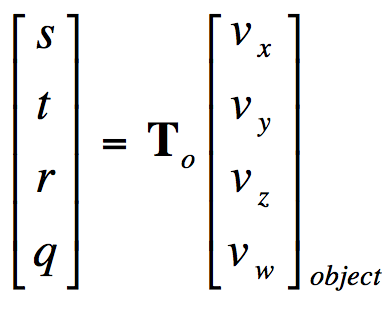

#Tutorial 4-1 - Projecting onto Geometry
**Introduction**
----
In this tutorial we will cover how to create a projector that will project images onto any geometry rendered in OpenGL. This tutorial will essentially be creating projector similar to a movie projector. This projector will be later used to splat satellite imagery onto a terrain or DEM. Our goal is to project a flat image onto the terrain.

**A Small Note**
I have created this code with in mind that the reader has implemented deferred shading. If the idea behind deferred shading is relatively foreign, then I suggested looking at ogldev's tutorial for deferred shading: .

**Required & Supplemental Readings**

1. https://developer.nvidia.com/system/files/akamai/gamedev/docs/projective_texture_mapping.pdf
2. http://www.rastertek.com/dx11tut43.html

**Libraries Required**

1. glm : http://glm.g-truc.net/0.9.7/index.html
2. gdal : http://www.gdal.org/

** Loading an Image **
----
Before even considering making a projector, a texture must be built for the purpose of viewing that texture. I have included some code in this tutorial that will load an image for you and even build the opengl texture for you using GDAL. As long as you use a format supported by GDAL it will build a texture for the purposes of using it in your projector. Or you can find your favorite texture loading tutorial with Google.

**What is a projector?**
-----
A projector is very much like a movie projector in the fact that it projects an image or movie onto a surface. The only big difference is that the projector we are making is not made of physical components. A projector in OpenGL requires a view matrix to place it somewhere in the world along with its view direction and a projection matrix that determines the type of matrix for the clipping plane. Of course with a projector an image is needed to be projected onto the terrain which will be discussed later in this tutorial. 

**Steps for Rendering the projector (simple view).** 

1. Place the projector
2. Check if geometry is inside the projector's frustrum
3. Apply projecter's texture to the geometry

**Different Types of Projection**

Orthographic and perspective projections are two types of projections that are commonly known, but there are others. In this tutorial I will be specifically using only an orthographic projection. Here is an example of the frustrum that is made by a perspective and orthographic projection.


The main difference between an orthographic and perspective projection can be seen from their frustrums. A point at some position in the orthographic frustrum is mapped back to the end of the frustrum volume (or the screen) and has a straight line. This means that any shape will be flattened and any 3D object you will get a flat view of it which is thanks to rectangular cube form this projection has. However, with a perspective projection  a 3D object will appear to have a depth because of the pyramid shape of its frustrum. 

Both of these projections can be used for a projector and being used to splat images onto the terrain. The projector that I am discussing will always be pointing down and projecting some image given to it. Since images are flat, the orthogrpahic projection would be the best choice for projecting imagery onto the terrain. Another good reason for using an orthographic projection is because the shape of the frustum in terms of its width and height always remain the same with the length. It will be easier to project a image of a certain size.

**Projecting onto Geometry**

Now that projections have been made clear lets go over how images are projected onto the terrain. I will be referencing from the OpenGL tutorial that I have placed in the Required Readings section. This will require some math to be covered for projecting an image onto geometry. One key that I would like to note is that the math required displaying geometry onto the screen is relatively the same as projecting onto the terrain. Now to go over some math and code.

**Some Math and Code to make a projector work.**

In order for the projector to place something onto the terrain, we first need to have a view matrix that will place the projector somewhere in the world like a camera. The second we will need is the projection matrix which will be orthographic. For the view matrix I will use glm's lookat to construct the view matrix and glm's ortho to construct the orthographic matrix. Also the projector must be constructed in such a way that it always points down.

Here is some code that constructs the view and projection matrix
```c++
// The view matrix
glm::vec3 up = glm::vec3(0, 0, -1); // We could set the projector's up to be (0,1,0), but then we would run into problems with glm.
glm::vec3 direction = glm::vec3(0, -1, 0); // face the projector down
glm::vec3 position = glm::vec3(110, 0, 110); // set some initial position
glm::mat4 view = glm::lookAt( position, //Eye Position
	                    position + direction, //Focus point
	                    up); //Positive Y is up

// The projection matrix
glm::mat4 projection = glm::ortho<float>(
-1000, // left of projection
1000, // right of projection
1000, // top of projection
-1000, // bottom of projection
0.9f, // z Near
10000.0f // z Far
);
```

I use glm::lookat to set the view matrix and I set the matrix to look straight down in the world. I used glm::ortho to create a orthographic projection. One key thing that I have learned about glm::ortho that it is best to specify the dimensions of the projection as glm::ortho(-x,x,y,-y,zNear,zFar) in order to get the projection to appear in the correct place with the right image dimensions.

Now that we have our projection and view matrix constructed we can check if the geometry is within the projector's frustrum. This step is important for insuring that the projector only casts a texture in the correct spot. In order to do this we need to project our projector's coordinate space onto the geometry. The following formula from the Nvidia paper will achieve this:


This matrix formulated by this calculation will transform a geometry's points into the texture's space. The V<sub>p</sub> is the view matrix and P<sub>p</sub> is the projection matrix constructed for the projector. The first matrix inside in the equation is a scaling matrix and the last matrix is the model matrix used to bring the geometry into world space. By using the transform matrix formulated by these equations we get uv coordinates that are projected onto the geometry. Here is what the generated texture coordinates will look after the this transformation matrix is applied to a point in the geometry: 



From working with textures commonly a two dimensional point is used, but in this case there is a four dimensional point. For this tutorial we only care about three of the dimensions: s,t, and q. The s and t dimensions are the uv coordinates that are commonly used for sampling textures and the q is used for checking to make sure the image is projected onto only the geometry(it is also used scaling). With this coordinate formed we can project an image onto some geometry or a surface. Here is some code that achieves that on the cpu side:
```c++
glm::mat4 scalingmatrix = glm::mat4(1.0 / 2.0, 0, 0, 1.0 / 2.0,
	                            0, 1.0 / 2.0, 0, 1.0 / 2.0,
	                            0, 0, 1.0 / 2.0, 1.0 / 2.0,
	                            0, 0, 0, 1.0);
// Using the view and projection matrix from the previous code.
glm::mat4 model = glm::mat4(1); // identity matrix .. not placing the geometry point somewhere
glm::vec4 somePoint; // Here is some point in the geometry 
glm::vec4 texturePoint = scalingmatrix * projection * view * model * point;

// Now a key thing if you have read the nvidia paper, then you know that the point has to be scale with q
// but this is taken care with the scaling matrix.
// Now to see if we can render it. ( x == s, y == t, w == q) 
// We need to make sure q is positive (we don't want double projection) 
// We also want to make sure x and y are between 0 and 1 because we only want to draw inside the frustrum.
if(texturePoint.w >= 0 && texturePoint.x >= 0 && texturePoint.y <= 1 && texturePoint.x >= 0 && texturePoint.y <= 1)
{
   DrawSomething();
}
```

This code in principal will work if we weren't using OpenGL. I have given as an example to show the concept of how the math works. Now lets go over the shader code required to make this possible. First let's pass in the required matrixes and required points(via deferred shading):

```glsl
#version 330 // Opengl version we are using 3.3
mat4 scaleprojview; 
sampler2D positionMap; // Our geometry points that have there model matrix already applied (model * point)

out vec4 outColor; // Where we are going to render too.
sampler2D outTex; // Our output texture
```

You will need to pass these matricies in and precompute the positions (or you could do it a forward rendering way more on this later).  

I will be assuming that all of the points of geometries are stored in a texture and have been precomputed (More on this later). We will be rendering the projector across the screen with a screen quad and to do that we will need the uv coordinates relative to the screen. Now lets compute the transformed points and do the same code as the CPU version.

```glsl
// Thank you oglvdev
uniform vec2 gScreenSize;
// Get screen coordinate uvs
vec2 CalcTexCoord()
{
    return gl_FragCoord.xy / gScreenSize; // Cal
}
void main()
{
    // Get Screen's uvs
    vec2 TexCoord = CalcTexCoord();
    
    // Get point from texture
    vec4 point = texture(positionMap,TexCoord);
    
    // calculate texture point projected onto the terrain
    vec4 projTexCoord = scaleprojview * point;
    
    // see if point is side frustrum and projected at this point
    if(projTexCoord.w >= 0 && projTexCoord.x >= 0 &&& projTexCoord.x <= 1 && projTexCoord.y >= 0 &&& projTexCoord.y <= 1)
    {
       outColor = texture(outTex,projTexCoord.xy;
    }
    
}

```

The above shader code will go point by point and produce an image projected onto the geometry. This code will work provided that you are using deferred shading and precompute the world positions into a texture. This will happen after the lighting phase in deferred shading.


**Steps for Rendering the Projector (OpenGL view)**

1. Place the projector
2. Compute world positions 
3. Compute scaled positions into projected texture space.
4. Determine if the texture needs to be drawed
5. Draw depending on 4.

**Some Extra Comments On Rendering**

This can be done in forward rendering, but you will need to the projector calculations per object and put it inside every shader. You will no longer need to create a frame renderer, but have your calculations on the inside of each object's shaders.

** The Projector Class **
---
The projector class will require the view, projection, and scaling matrix. It  will have to be robusted enough to place the projector into different places. Here is example of the class I created to keep track of the projector:
```c++
#ifndef _PROJECTOR_H_
#define _PROJECTOR_H_
class projector : renderable
{
public:

	enum PROJECTOR_TYPE
	{
		IMAGE,
		DATA
	};
	
	// consructor
	projector();
	void setup();
	void update(float dt);
	void render(glm::mat4& view, glm::mat4& projection);
	
	// a function for setting the screen dimension
	void setScreenDims(int width, int height)
	{
		SCREEN_WIDTH = width;
		SCREEN_HEIGHT = height;
	};
       
        // the projector type will be discussed later along with band number
	void setFile(std::string fname,PROJECTOR_TYPE type = IMAGE,int band=1)
	{
		filename = fname;
		projtype = type;
		bandnum = band;
	};
       
        // this will be used later
	void setmask(std::string maskname)
	{
		maskfile = maskname;
	};

	void SetPosition(glm::vec3 p)
	{
		position = p;
	};
       
        // Setting the dimensions for the projector frustrum
	void SetDimensions(float width, float height)
	{
		projection = glm::ortho<float>(-width / 2.0f, width / 2.0f, height / 2.0f, -height / 2.0f, 0.1f, 10000.0f);
	};

	void SetPosition(float x, float y)
	{
		position.x = x;
		position.z = y;
		position.y = 100;
	};

private:
	// A screen width and height
	int SCREEN_WIDTH, SCREEN_HEIGHT;
	
	// view,projection, and scaling matrix
	glm::mat4 view;
	glm::mat4 projection;
	glm::mat4 Texgen;
	
	// these are necessary for the view matrix
	glm::vec3 direction;
	glm::vec3 position;
	glm::vec3 up;
	glm::vec2 origin;
	
	// something to hold our screen rect -- I created the buffer class
	buffer Buffer;
	
	// Something to hold our projector texture 
	GLuint tex,masktex; // we will discuss the mask tex later
	string filename; // a filename from wheich we load our texture
	
	//the width and height the projector texture
	int width, height;
	
	// the resolution per pixel -- this will be used later
	double xres, yres;
	
	// used for different types of projectors
	PROJECTOR_TYPE projtype;
};
#endif
```
One key function to note is SetDimensions where the projector's image is set to the proper size by setting glm:ortho as follows glm::ortho(-width/2,width/2,height/2,-height/2,zNear,zFar).  The projector's position is set based on the SetPosition function. *The projector is designed to be placed based at the upper left corner of the frustrum and is the projector's position*. 

Here is the rendering function required for the projector to work (with some details omitted for later tutorials):
```c++
// view2 and projector2 are the view and projection matrixes for the main camera
void projector::render(glm::mat4& view2, glm::mat4& projection2)
{
	// update the projectors view matrix
	view = glm::lookAt( position, //Eye Position
	                    position + direction, //Focus point
	                    up);
	
	// set the projectors texture active 
	glActiveTexture(GL_TEXTURE0 + 5); // I have mine mapped ot 5 position -- due to other tutorials
	glBindTexture(GL_TEXTURE_2D, tex);
	
	// for later tutorials
	if(masktex)
	{
		glActiveTexture(GL_TEXTURE0 + 6);
		glBindTexture(GL_TEXTURE_2D,masktex);
	}

	// glenable
	Renderer.useProgram();
	Buffer.bindBuffer(); // glbindbuffer
	
	// getuniformattriblocation
	Renderer.enableVertexAttribPointer("Position");
	// set the data at the attirb location
	Renderer.setGLVertexAttribPointer("Position", 2, GL_FLOAT, GL_FALSE, sizeof(float), 0);

	// enable three textures for defered rendering
	Renderer.setUniformInteger("gPositionMap", 0);
	Renderer.setUniformInteger("gTextureMap", 4);
	Renderer.setUniformInteger("proj_tex", 5); // projectors texture
	Renderer.setUniformInteger("mask_tex",6); // for later tutorials

	// set the screen size
	float SCREEN_SIZE[2] = {(float)SCREEN_WIDTH, (float)SCREEN_HEIGHT};
	
	Renderer.setUniformFloatArray2("gScreenSize", 1, SCREEN_SIZE);
	
	// set the matrixs -- gluniform functions
	Renderer.setUniformMatrix4x4("projection", projection);
	Renderer.setUniformMatrix4x4("view", view);
	Renderer.setUniformMatrix4x4("tex", Texgen); // scaling matrix we discussed earlier

	// render our projector
	Renderer.renderRaw(GL_TRIANGLES, 12); // gldrawelements
	
	// disable attributes
	Renderer.disableVertexAttribPointer("Position");
}

```

With these short code segments you should be able to render a projector or alternatively you can use the code I have provided as a starting point.

**Example Application**
----
The code that comes with the tutorial will produce the following output:


I created a projector that uses the smiley-face.png and projects onto a plane that is of width and height 1000 centered at the origin. The projector is set to project with a width and height of 500 and is placed at the origin.

```c++
	// plane initialization code
	Plane.buildPlane(-500,-500,1000,1000);
	
	// projector initialization code
	pr.setFile(AssetManager::GetAppPath() + "../smiley-face.png");
	pr.setup();
	pr.setScreenDims(SCREEN_WIDTH, SCREEN_HEIGHT);
	pr.SetDimensions(500,500);
	pr.SetPosition(0,0);
```

This example can be used as a starting point.

**Concluding Notes and Next Tutorial**
-----
In the next tutorial, I will introduce how to create multiple projectors and blend them together all at the same time. 
