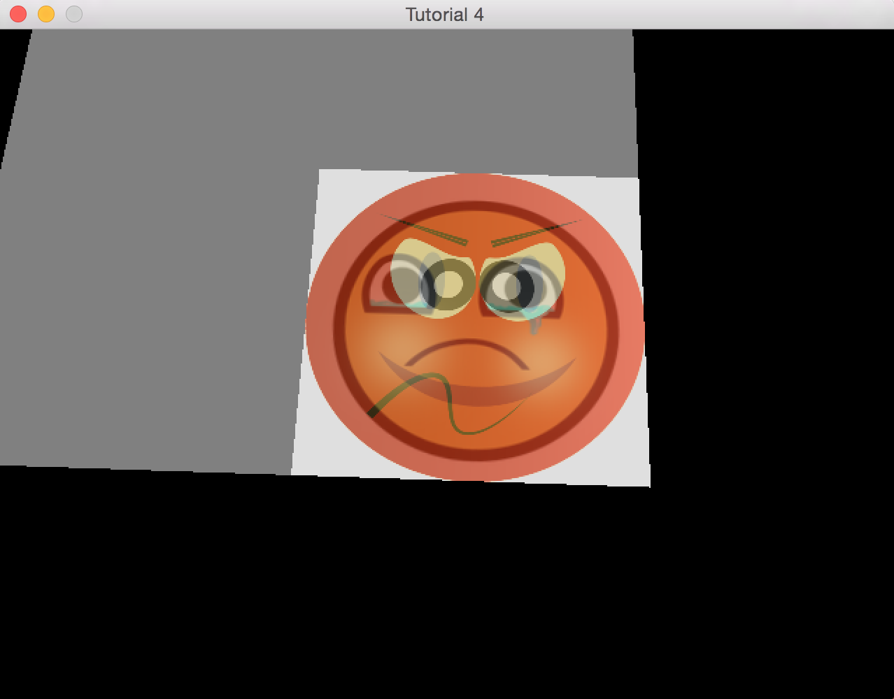

#Tutorial 4-2 -- Projecting Multiple Textures
**Introduction**
----
In this tutorial I will be going over how to project multiple projectors and the blending required for putting these projectors together. Last time I introduced how to project one projector onto the terrain. This will be the main starting point of this tutorial and it is expected that the reader has gone through this tutorial previously. This tutorial will be assuming that you are using differed shading for rendering.

**Rendering Multiple Textures**
---
The idea of rendering multiple projector's is simple because one could simply just write one code for one projector and invoke that code multiple times. This will produce the goal of rendering multiple projector's until your projector's overlap each other. When two projector's overlap the image of the last projector will overlap the other projector. This result doesn't make sense because one would expect at least one part of the image to be within the other image. What these two projectors need is blending.

**Blending**

Blending is a necessity for allowing the image of other projector's to appear through the last projector. Blending the projector's together will require that you have knowledge of alpha blending at the OpenGL level, but don't worry this tutorial will cover the basics of blending. The alpha blending of the texture will allow the projectors overlapping portions to be seen and allow for the opacity of a projector to be controllable.

The following block discusses alpha blending:
```fundamental
Every color has an r,g,b value with an a value where
r = red
g = green
b = blue
a = alpha

We are concerned with the alpha value of colors.

This alpha value will control the opacity of the colors or how much it appears in the scene. If this value is set to 1, then it will mean that color is fully there; while a value of .5 will mean the color is half present. 

In OpenGL there are two types of colors that are present in rendering which are source color and destination colors. Source color is the color to be rendered and destination color is the color that is currently on the screen.

A source and destination color can be blended together in many ways but our main focus is on a technique called alpha blending which can be achieved with the following equation:

sc = source color
dc = destination color
ndc = destination color

ndc = sc.a *sc + (1-sc.a) * dc or (ndc = source alpha * sc + (1 - source alpha) * destination color)

The alpha value of the source effectively controls how much color of the source is added into the scene.
```

The above block discussed alpha blending and shows how two different colors can be blended with the alpha value of the source color. The equivalent code in OpenGL is shown here along with comments that explain how alpha blending is being triggered:

```c++
glEnable(GL_BLEND); // enable blending
// glBlendFunc simply does what I described in the block
// The first argument is for what will be applied to the source color.
// The second argument is for what will be applied to the destination color.
// In the block above I demonstrated that the two colors will be added for blending. This holds true for OpenGL
// by default.
glBlendFunc(GL_SRC_ALPHA, GL_ONE_MINUS_SRC_ALPHA);
// Render something -- projector's would go here. 

// Disable blending
glDisable(GL_BLEND);
``` 
**New Steps for Rendering (simplified)**

1. Draw Lights
2. Start blending with alpha blending
3. Draw projectors
4. End blending

**Some New Additions to the Projector**

The will allow us to do alpha blending with the projector created in the first tutorial. However we first need to add some way of controlling the alpha value of a projector in order to control the opacity. This can simply be added to the shader we generated for the first tutorial and some extra code to pass the parameter to the shader.

The new shader:
```glsl

// We will use this to control the opacity of the projector.
uniform float alpha;

// Thank you oglvdev
uniform vec2 gScreenSize;

// Get screen coordinate uvs
vec2 CalcTexCoord()
{
    return gl_FragCoord.xy / gScreenSize; // Cal
}

void main()
{
    // Get Screen's uvs
    vec2 TexCoord = CalcTexCoord();
    
    // Get point from texture
    vec4 point = texture(positionMap,TexCoord);
    
    // calculate texture point projected onto the terrain
    vec4 projTexCoord = scaleprojview * point;
    
    // see if point is side frustrum and projected at this point
    if(projTexCoord.w >= 0 && projTexCoord.x >= 0 &&& projTexCoord.x <= 1 && projTexCoord.y >= 0 &&& projTexCoord.y <= 1)
    {
       outColor = vec4(texture(outTex,projTexCoord.xy).xyz,alpha);
    }
    
}
```

As you can see I have added a new alpha variable that will be used for controlling the alpha value of the projector. Now of course you could always hard code this value to be .5 so that every projector appears half in the scene.

Here is the one function  or set of functions that needs to be added to the projector for it work:

```c++
class projector
{
public:
.
.
.
	void setTranslucency(float Alpha)
	{
		alpha = Alpha;
	};

	void incTranslucency(float alph)
	{
		alpha += alph;
		if(alpha >= 1)
		{
			alpha = 1;
		}
		cout << alpha << endl;
	};

	void decTranslucency(float alph)
	{
		alpha -= alph;
		if(alpha <= 0)
		{
			alpha = 0;
		}
		cout << alpha << endl;
	};
private:
.
float alpha;
.
}

void projector::render(...)
{
..
..
..
// Pass in the float ... the equivalent shader would required you to get the
// the uniform's address and then to use a function like uniformfi to pass the alpha.
// My renderer class already does this.
Renderer.setUniformFloat("alpha", alpha);
..
}
```

**Example**
----
The code that comes with this tutorial will produce the following output will all projectors are set at the same alpha value of .5:



**Next Tutorial**
---
In the next tutorial we will be going over how to take the created code so far and project an image onto terrain at the correct spot.
