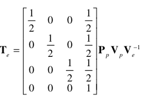
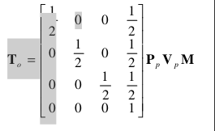
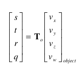

#Tutorial 4: Projecting GIS Imagery onto a Terrain with Projective Mapping

**Introduction**
-----
In this tutorial, I will be talking how to create to use projective mapping to place images onto the terrain we produced in tutorial 4. 

Required Readings
* https://developer.nvidia.com/system/files/akamai/gamedev/docs/projective_texture_mapping.pdf

Be Aware of
* Deffered Shading
* Alpha Blending
**Projective Texture Mapping**
---
The idea behind projective texture mapping is to produce a set of uvs that will be used for the purpose of projecting an image onto a surface. Projective texture mapping works very similar to the way to the main camera that is commonly used in OpenGL. Projective texture mapping makes use of its own projection and view matrixes like a main camera, except that everything is being projected into the world on some surface. For now we will refer to projective texture mapping in general terms as a projector.

Our first goal is to understand how a projector has its own view and projection matrix with the addition of a scaling matrix that are essential to producing uvs that are projected onto the terrain (I will be calling the combination of these matrixes a texgen matrix). In the Nvidia paper it throws these two equations at the reader for developing the texgen matrix:

**Coordinates are in view space**


**Coordinates are in object space**


Both of the following equations above are equivalent and are just demonstrating two different cases where you either have coordinates in object or view space. The first equation above simply reverts to the second case (make sure you understand the differences between view and object space). For the rest of this tutorial we will focus on the object space case. 

The Nvidia paper specifies that one must use the following equation to transform a object space point into uv coordinates as follows:



The Vx-w components are your coordinates in object space, while T<sub>o</sub> is the texgen matrix produce in case two above. As you can see the only thing we need for a projector is its projection matrix, view matrix, scaling matrix, and of course we need some kind of image or data to project. 

One question that may be entering your mind is about the coordinates produced on the right side of the above question or the uv coordinates we need for the projecting and the scaling matrix. The paper specifies that the s,t components are typically divided by q to bring them into a normalized range between 0 and 1 but while making some other considerations such as the projection and view matrix brings our final point into clip space where the window width and height are mapped to [-1/2,1/2],[-1/2,1/2]. The following tutorial does a good job of taking care of these considerations http://www.rastertek.com/dx11tut43.html by multiplying and adding by 1/2 to the produced clip space coordinates (after they have been divided by q). Unfortunately we don't need to that when the scaling matrix already does the dividing by q and multiplying and adding for us (I dare you to find how equivalent these two are (left as an exercise for the reader)). So Nvidia just did something equivalent for scaling and normaling the uvs into a [0,1] range. The point is we don't need to worry about dividing by q (or adding and multiplying 1/2) to s and t thanks to this scaling matrix.

On to the code.
**The Code**
----
How many things do we need to keep track for this projector we are creating to work. The answer is simple: the view matrix, projection matrix, scaling matrix, and the image or data being used for this projector. Here is what we are keeping track of:
```c++
glm::mat4 view; // Lets use glm look at to make things simple
glm::mat4 projection; // orthographic projections are nice for demonstrating satellite images and data
glm::mat4 scalingMatrix = glm::mat4(1/2,0,0,1/2,
                                    0,1/2,0,1/2,
                                    0,0,1/2,1/2,
                                    0,0,0,1);
gluint SomeImageOrData;
```
**With Deferred Shading**
We now have enough information to put our projector somewhere and project imagery into the world assuming that we are using deffered shading, but it would be different with forward (more on this later). 

**With Forward Shading**

**Create two types of imagery.**

**Placing the Imagery into the correct spot.**

**Application Example**
----

**Resulting Screenshot**

**Verification Screenshot**


**Still under construction.. but to get a head start look at the following https://developer.nvidia.com/system/files/akamai/gamedev/docs/projective_texture_mapping.pdf. **
