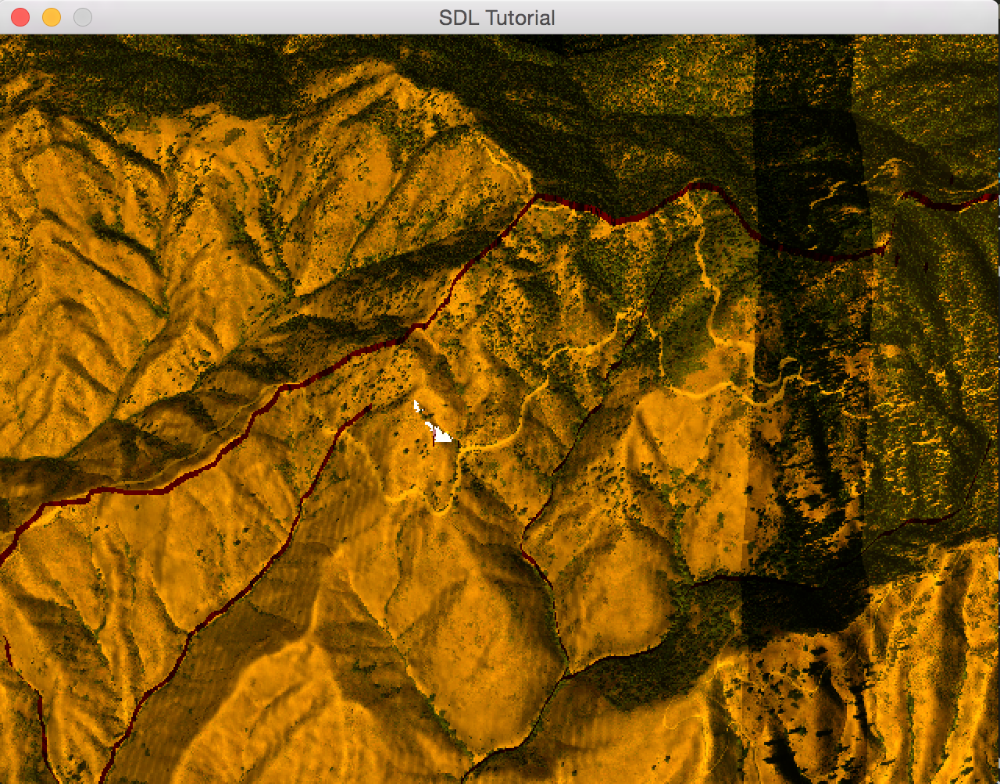
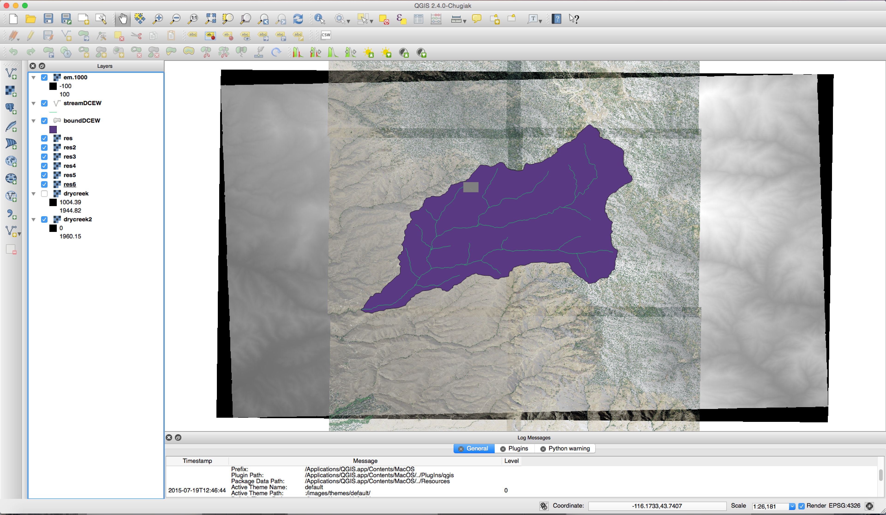

#Tutorial 4: Projecting GIS Imagery onto a Terrain

Required Readings
* https://developer.nvidia.com/system/files/akamai/gamedev/docs/projective_texture_mapping.pdf

**Projective Texture Mapping**

**Create two types of imagery.**

**Placing the Imagery into the correct spot.**

**Application Example**
----

**Resulting Screenshot**

**Verification Screenshot**

**Still under construction.. but to get a head start look at the following https://developer.nvidia.com/system/files/akamai/gamedev/docs/projective_texture_mapping.pdf. **
