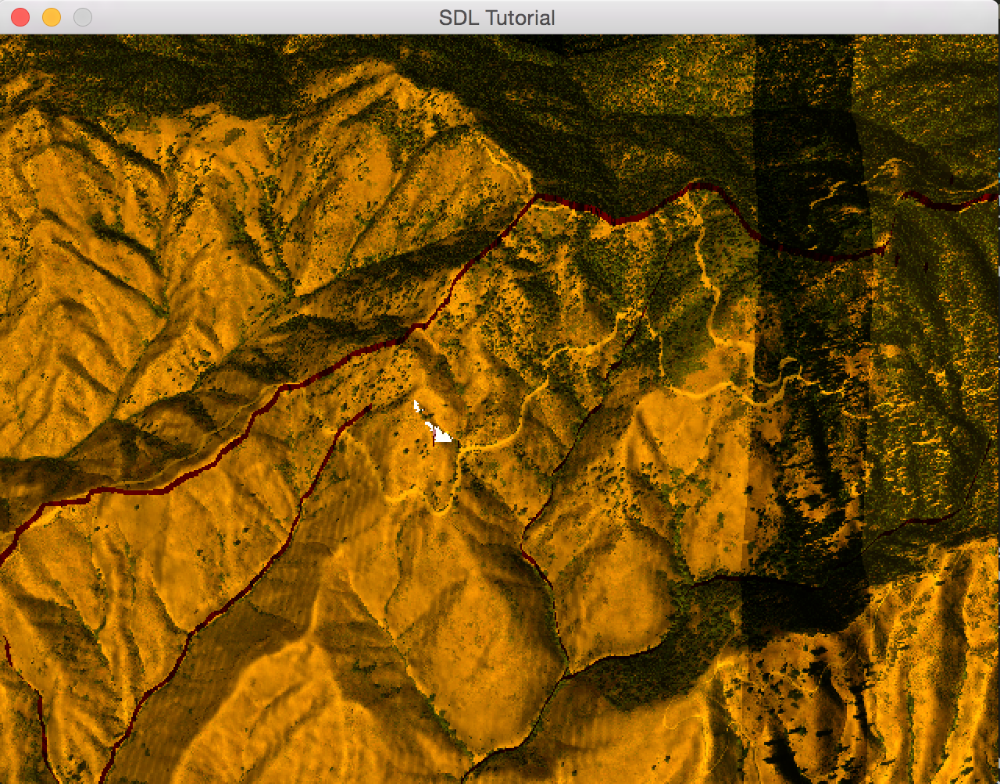
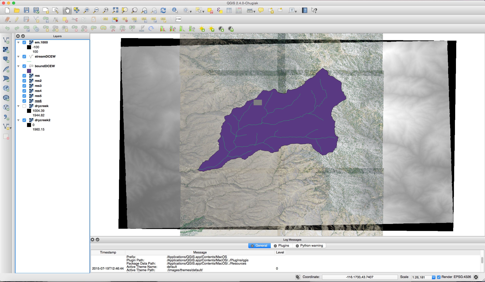

#Tutorial 5: Projecting GIS Imagery onto a Terrain with a Projector

**Introduction**
-----
In this tutorial, I will be talking how to create to use projective mapping to place images onto the terrain we produced in tutorial 2. For this tutorial we will be using drycreek2.tif which has been modified to make projecting onto the surface of this terrain easier by bringing it into a projection that does not require any estimation techniques.

Drycreek2.tif was created with and can be found in the data folder in this collection of tutorials:
```bash
gdalwarp -t_srs epsg:26911 drycreek.tif drycreek2.tif # This brings Dry Creek into zone 11. 
```

I will be assuming that you have done tutorial 4-1 and 4-2 and know about differed shading.

**Creating two types of imagery.**
-----

We now know how to place a projector and to pick a projection to project an image onto the terrain. For the purposes of this tutorial, I will be introducing how to project a satellite image and raw floating pointing data onto the terrain.

**Satellite Imagery**

In order to generate satellite imagery, we need to first open an image and get the bytes out of the image. All of which we will be using gdal for. Here is some code that will do that(along with comments that explain the inner working of the code):
```c++
void generateImageTexture(string fname, GLuint& tex, string& projection,double& xorigin, double& yorigin, int& width, int& height, double& xres, double& yres)
{

  GDALDataset *poDataset;
  GDALAllRegister();
  
  // We are loading a gdal dataset here:
  poDataset = (GDALDataset*) GDALOpen(fname.c_str(), GA_ReadOnly);
  if (poDataset == NULL)
  {
    // Something went wrong here!
    cout << "OUCH!" << endl;
    //exit(0);
    return;
  }
  
  // Printing out the dimensions of our dataset set (width,height)
  cout << "Data size: " << GDALGetRasterXSize(poDataset) << " " << GDALGetRasterYSize(poDataset) << endl;
  width = GDALGetRasterXSize(poDataset);
  height = GDALGetRasterYSize(poDataset);

  GDALRasterBand  *poBand;
  int             nBlockXSize, nBlockYSize;
  int             bGotMin, bGotMax;
  double          adfMinMax[2];
  int numbands = poDataset->GetRasterCount();
  cout << numbands << endl;
  
  // I wrote this code to only handle four bands.. where the four bands are red, green,blue,alpha
  if(numbands != 4)
  {
    cerr << "NOT FOUR BANDS!!!" << endl;
    GDALClose( (GDALDatasetH) poDataset);
    return;
  }

  // yay stack allocation -- replace with dynamic in the future -- yep
  unsigned char** data; 
  unsigned char* packeddata;

  data = new unsigned char*[numbands];
  packeddata = new unsigned char[numbands*width*height];

  // iterate through the data and store it one chunk
  for (int i = 0; i < numbands; i++ )
  {
      data[i] = new unsigned char[width*height];
      cout << i << endl;
      GDALRasterBand  *poBand;
      poBand = poDataset->GetRasterBand( i+1 );
      // Used unsiged chars for data type
      poBand->RasterIO(GF_Read, 0, 0, width, height, data[i], width, height, GDT_Byte, 0, 0);
      cout << (int)data[i][0] << endl;
  }

  // Pack the bytes into an order R,G,B,A,R,G,B,A,.....,R,G,B,A
  for(int i =0; i < width*height; i++)
  {
    packeddata[i*4] = data[0][i];
    packeddata[i*4+1] = data[1][i];
    packeddata[i*4+2] = data[2][i];
    packeddata[i*4+3] = data[3][i];
  }

  // generate a opengl texture
  glGenTextures(1, &tex);
  glBindTexture(GL_TEXTURE_2D, tex);
  glTexParameteri(GL_TEXTURE_2D, GL_TEXTURE_MIN_FILTER, GL_NEAREST);
  glTexParameteri(GL_TEXTURE_2D, GL_TEXTURE_MAG_FILTER, GL_NEAREST);
  glTexImage2D(GL_TEXTURE_2D, 0, GL_RGBA, width, height, 0, GL_RGBA, GL_UNSIGNED_BYTE, &packeddata[0]);

  // Clean up some allocated data
  delete []packeddata;

  for(int i = 0; i < numbands; i++)
  {
    delete []data[i];
  }
  
  delete []data;
  
  // get the projection of this satellite imagery
  projection = string(poDataset->GetProjectionRef());
  
  // two corners of the image
  double xright,ybottom;
  
  // get all of the corniers for this image and compute the average xres and yres.
  // this is the function that is putting everything into utm .. this was part of an earlier tutorial
  ComputeGeoProperties(poDataset, width, height, xorigin, yorigin, xright, ybottom, xres, yres);
  
  GDALClose( (GDALDatasetH) poDataset);

  return;
}
```

As you will see in the code, I get all four bytes of the satellite imagery data and push them into a OpenGL Texture 2D. The Satellite Imagery four bands are litterally red,green,blue, and alpha for this image. Passing this into the shaders should be enough to show something. This code also assumes that the satellite image only has four bands, so I am living it as an exercise for those who want to use higher quality landsat images that have more than four bands.

**Floating Point Datasets**

Another type of dataset that is not necessarily a satellite image is are raw floating datasets. I have provided an example dataset of this type called em.1000.tif in the data folder. Another thing about this dataset is that possess multiple bands and those multiple bands can correspond to real world data. In this case this dataset corresponds to ftp://ftp.nwrc.ars.usda.gov/ipw/Marks%20et%20al%201999/man1/isnobal.html in the Energy & mass flux image. This dataset consists of ten bands and represents one timestep in a year for a model called isnobal or a energy-balance snowmelt model.

The following code below will give an example of how to pull this data out (tutorial 2 should make this more familiar) and a process of normalization will be used to bring the values between 0 and 1. Here is some example code that achieves pulling out the data and the normalization:

```c++
void generateTexture(string fname, GLuint& tex, int bandnum, string& projection,double& xorigin, double& yorigin, int& width, int& height, double& xres, double& yres)
{

  if (bandnum <= 0 )
  {
    bandnum = 1;
  }
  GDALDataset *poDataset;
  GDALAllRegister();
  poDataset = (GDALDataset*) GDALOpen(fname.c_str(), GA_ReadOnly);
  if (poDataset == NULL)
  {
    cout << "OUCH!" << endl;
    //exit(0);
    return;
  }
  projection = string(poDataset->GetProjectionRef());
  width = GDALGetRasterXSize(poDataset);
  height = GDALGetRasterYSize(poDataset);

  GDALRasterBand  *poBand;
  int             nBlockXSize, nBlockYSize;
  int             bGotMin, bGotMax;
  double          adfMinMax[2];
  int bands = poDataset->GetRasterCount();
  bandnum = bandnum % bands + 1;
  if (bandnum > bands)
  {
    bandnum = 1;
  }
  poBand = poDataset->GetRasterBand( bandnum );
  poBand->GetBlockSize( &nBlockXSize, &nBlockYSize );
  printf( "Block=%dx%d Type=%s, ColorInterp=%s\n",
          nBlockXSize, nBlockYSize,
          GDALGetDataTypeName(poBand->GetRasterDataType()),
          GDALGetColorInterpretationName(
            poBand->GetColorInterpretation()) );

  float max = adfMinMax[0] = poBand->GetMinimum( &bGotMin );
  float min = adfMinMax[1] = poBand->GetMaximum( &bGotMax );
  if ( ! (bGotMin && bGotMax) )
    GDALComputeRasterMinMax((GDALRasterBandH)poBand, TRUE, adfMinMax);


  float *pafScanline;
  min = adfMinMax[0];
  max = adfMinMax[1];

  pafScanline = (float *) CPLMalloc(sizeof(float) * 512 * 512);
  vector<vector<float>> out = vector<vector<float>>(height, vector<float> (width, 0));
  //vector<vector<unsigned char>> texs = vector<vector<unsigned char>>(height,vector<unsigned char> (width,0));
  unsigned char texs[512 * 512];
  
  // Here I am downsampling the float array to 512 x 512.  Not necessarily needed.
  poBand->RasterIO(GF_Read, 0, 0, width, height, pafScanline, 512, 512, GDT_Float32, 0, 0);
  float no = poBand->GetNoDataValue();

  for (int i = 0; i < 512; i++)
  {
    for (int j = 0; j < 512; j++)
    {
      //cout << i << j << endl << pafS;
      if (pafScanline[i * width + j] != no)
      {
        // set tex val -- normalize values to a range between 0 and 1
        texs[i * 512 + j] = (unsigned char)(255 * abs((pafScanline[i * 512 + j] - min) / (max - min)));
      }
      else
      {
        // Set zero val == setting any no data values to zero
        texs[i * 512 + j] = 0;
      }
    }
  }
  CPLFree(pafScanline);
  double xright,ybottom;
  ComputeGeoProperties(poDataset, width, height, xorigin, yorigin, xright, ybottom, xres, yres);
  width = height = 512;
  xres = (xright - xorigin)/512.0f;
  yres = (yorigin - ybottom)/512.0f;

  // Create a texture
  glGenTextures(1, &tex);
  glBindTexture(GL_TEXTURE_2D, tex);
  glTexParameteri(GL_TEXTURE_2D, GL_TEXTURE_MIN_FILTER, GL_NEAREST);
  glTexParameteri(GL_TEXTURE_2D, GL_TEXTURE_MAG_FILTER, GL_NEAREST);
  // Our normalized values are stored in the red channel
  glTexImage2D(GL_TEXTURE_2D, 0, GL_RED, 512, 512, 0, GL_RED, GL_UNSIGNED_BYTE, texs);
  GDALClose( (GDALDatasetH) poDataset);

  return;
}
```

With the normalized ranges computed we can now in a shader do the following to represent the data:
```glsl
colorout = mix(lowcolor,highcolor,normalizedvalue.a); // all you need to do is pass the values into the shader through the texture
```

**Part B: Floating Point Dataset or Image Masks**
I have discussed how it would be possible to load images or floating point datasets. However, what if one wishes to mask a part of the data that is being visualized. The key thing to do here would be to load a mask image that will mask the key vital areas. 

Steps for applying a mask:
1. Load the mask in the same way for the float data
2. Pass the mask into the shader
3. Draw only where the mask has values

```glsl
// assuming the mask values are stored in the red channel
float maskval = texture(masksampler,uv).r;

if(maskval > 0 )
colorout = mix(lowcolor,highcolor,normalizedvalue.a);
else
discard; // or colorout = vec4(0,0,0,0); The point here is that we don't want to draw where there is no mask value. 
```
**Placing the Imagery into the correct spot.**

Just like the shapes and other gis datasets we need to place everything into the correct spot and at the same time make sure the image is the right size and resolution. The very first thing we need to do is find the width, height, and origin of the a dataset (A small review).

```c++
void ComputeGeoProperties(GDALDataset *poDataset, int width, int height, double& x, double& y, double& xright, double& ybottom, double& xres, double& yres)
{
  double adfGeoTransform[6];
  if ( poDataset->GetGeoTransform( adfGeoTransform ) == CE_None )
  {
    printf( "Origin = (%.6f,%.6f)\n",
            adfGeoTransform[0], adfGeoTransform[3] );

    printf( "Pixel Size = (%.6f,%.6f)\n",
            adfGeoTransform[1], adfGeoTransform[5] );
    x = adfGeoTransform[0];
    y = adfGeoTransform[3];
    xright = x + adfGeoTransform[1] * (double)(width);
    ybottom = y + adfGeoTransform[5] * (double)(height);
  }
  else
  {
    return;
  }

  string proj;
  proj = string(poDataset->GetProjectionRef());

  OGRSpatialReference sr2;
  char* test = &proj[0];
  sr2.importFromWkt(&test);

  // Get Geography Coordinate System
  OGRSpatialReference* geog2 = sr2.CloneGeogCS();

  // Now to create coordinate transform function
  OGRCoordinateTransformation* poTransform2 = OGRCreateCoordinateTransformation( &sr2, geog2 );

  // Compute corners
  double x2=0;
  //poTransform2->Transform(1, &x2, &y);
  //poTransform2->Transform(1, &xright, &ybottom);

  // Transform to utm on both corners
  //transformToUtm(x, y,&sr2);
  //transformToUtm(xright, ybottom,&sr2);

  // Lets compute the resolution -- Despite the one provided by the geotransform
  double absoluteW = xright - x;
  double absoluteH = y - ybottom;

  // now lets compute the average resolution of the DEM
  xres = absoluteW / (width);
  yres = absoluteH / (height);
  cout << "XRES: " << xres << "YRES: " << yres<< endl;
    cout << "XRIGHT" <<xright << " " << ybottom << endl;
  cout << "x" << x << " " << y << endl;
  cout << width << endl;
  cout << height << endl;
  cout << y << endl;
  //exit(0);
};
```

With all of this information we can now place the projector above the spot we wish to project the image and set it proper boundaries for the projection. First a question for the reader: What type of projection is appropriate for projecting the image onto the terrain? The appropriate answer would be it depends on how you do it and how easy you want to make your life. Here is an image of a perspective and orthographic projection:


As you can see the perspective projection on the left that has a pyramid shape would be difficult to get the correct projected image onto the terrain because you have to spend time finding the correct elevation to put the projector. While the orthographic projection can be placed at any height and still be the same thanks to it projecting a plane. Here is some code that places the projector into the correct spot and sits the projection correctly.

```c++

	void SetDimensions(float width, float height)
	{
		projection = glm::ortho<float>(-width / 2.0f, width / 2.0f, height / 2.0f, -height / 2.0f, 0.1f, 10000.0f);
	};
	
	void setToMainCoordinateSystem(OGRSpatialReference* main, glm::vec2 mainorigin)
	{

		// translate to main coordinate system
		OGRCoordinateTransformation* transform;
		if (main != NULL)
		{
			transform = OGRCreateCoordinateTransformation( &sr, main );
		}
		else
		{
			return;
		}
		double x = origin.x;
		double y = origin.y;
		double xright,ybottom;
		xright = x + xres*width;
		ybottom = y - yres*height;


		transform->Transform(1,&x,&y);
		transform->Transform(1,&xright,&ybottom);

		double XRES = (xright-x) / width;
		double YRES = (y - ybottom) / height;

		// set projector width and height
		SetDimensions((xright-x),(y - ybottom));
		x = x - mainorigin.x;
		y = mainorigin.y - y;
		
		// the projectors y is at 3000 or remotely above the terrain so that the frustrum will go through the terrain
		position.x = x;
		position.z = y;


		cout << "projector position" << x << " " << y;
		//exit(0);
	};
	
void projector::render(glm::mat4& view2, glm::mat4& projection2)
{
	// remains the same as above
	view = glm::lookAt( position, //Eye Position
	                    position + direction, //Focus point
	                    up);
	                    .
	                    .
	                    .
	                    .
}	         
```
As you can see the process of placing the projector into the correct spot and making the texture the right resolution are a combination of tutorials 2 and 3. One small note about glm::lookAt is that the up is placed on the negative z axis and the projector direction is made to look at negative y axis which is equilvalent to looking straight down. Make the frustrum collides with your terrain.

**How to visualize everything correctly.**

Steps for rendering (Deferred Shading):

1. Do Geometry Pass
2. Do Projection Pass into projector framebuffer.
3. Do Lighthing Pass

The steps above are straight forward and need very little explanation. We want our projected result to blend with anything from the lighting pass. We need to make sure that the projected image will appear through the lighting and other projectors (they may overlap). The best way is to blend the output of the projectors into one texture (one way is to use discard in the shader or to use gl_blend(discard is easier)).

```c++
// switch to Multiple render targets
// Set proper depth buffer
// clear color to black.
// use gbuffer fragment buffer 
//geometry pass

// use pbuffer fragment buffer
glblendequation(GL_FUNC_ADD);
glBlendFunc(GL_SRC_ALPHA,GL_DST_ALPHA);

// Projector pass -- use discard and glblend with another framebuffer -- make sure to clear it to black
// render the projectors -- to blend them in case overlap make sure clear color is black

// Switch to default buffer -- blend the light
glBlendEquation(GL_FUNC_ADD);
glBlendFunc(GL_ONE, GL_ONE);
// Do lighting phase
glDisable(GL_BLEND);
```

**Application Example**
----
To run the example:
```bash
cd build
make
../bin/out
```

Here is one screenshot from running my example code and two verification screenshots from qgis.
**Resulting Screenshot**

**Verification Screenshots**



**Issues**

As you will notice in the screenshots the projector overlaps onto of the shapes which can be undesireable in some cases. The simple fix for this to identify all objects in the same and store their identifies into a texture. With the identity known a simple if statement is needed for telling the projector not to render on a shape identity.

**Final Note**

This should give you enough to create your very own projector for projecting GIS datasets.
